# 📘 Project Evidence Documentation

This document provides evidence of successful completion of all stages of the project, including Dockerization, container orchestration, and Kubernetes deployment.

---

## 🔹 1. Docker Build Process Completion

The application Docker image was successfully built using the provided Dockerfile.

**Evidence:**

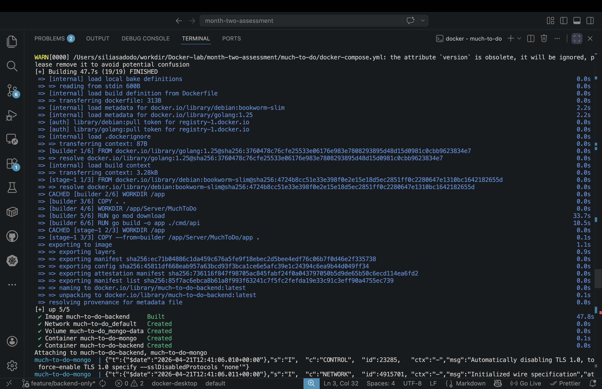
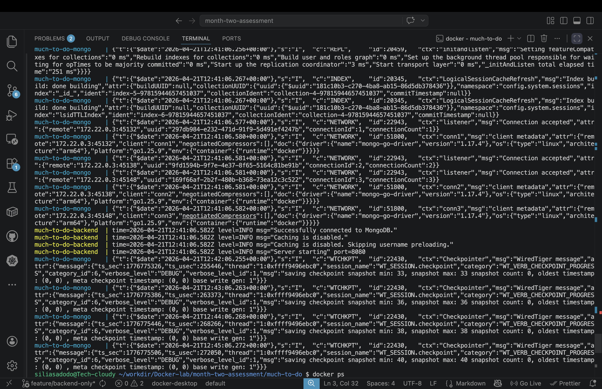
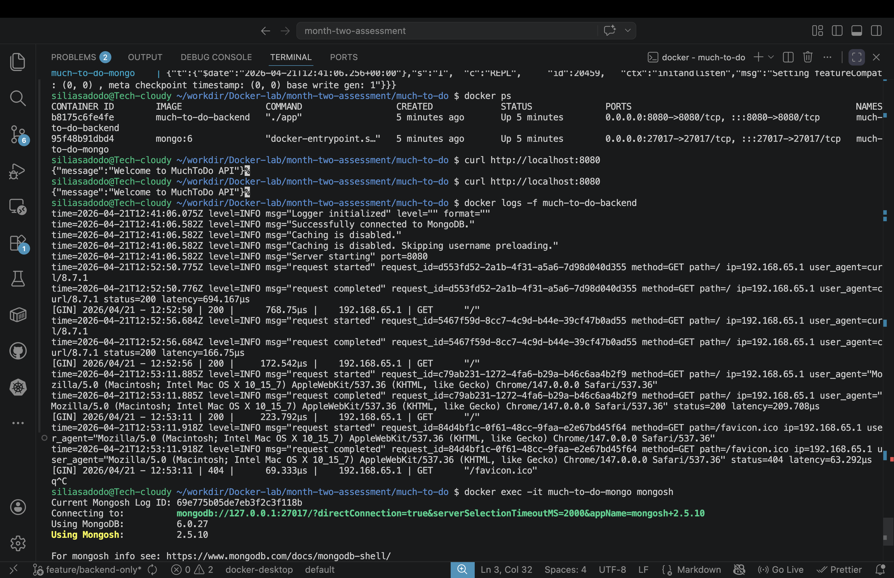

---

## 🔹 2. Docker Compose Running Successfully

The multi-container setup (backend + MongoDB) was successfully orchestrated using Docker Compose.

**Evidence:**

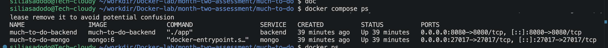

---

## 🔹 3. Application Responding via Docker Compose

The application was verified to be accessible and responding correctly when running through Docker Compose.

**Evidence:**

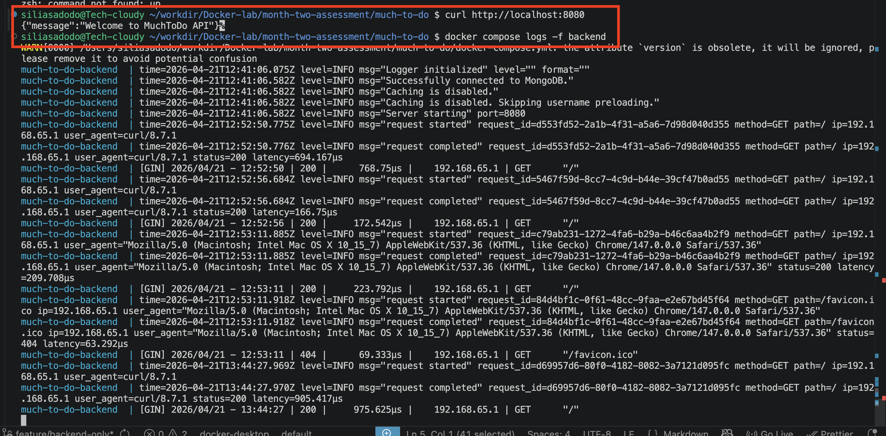

---

## 🔹 4. Kind Cluster Creation

A local Kubernetes cluster was successfully created using kind.

**Evidence:**

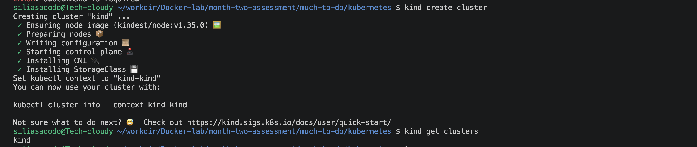

---

## 🔹 5. Kubernetes Deployments Running

All Kubernetes deployments (backend and MongoDB) were successfully created and are in a running state.

**Evidence:**

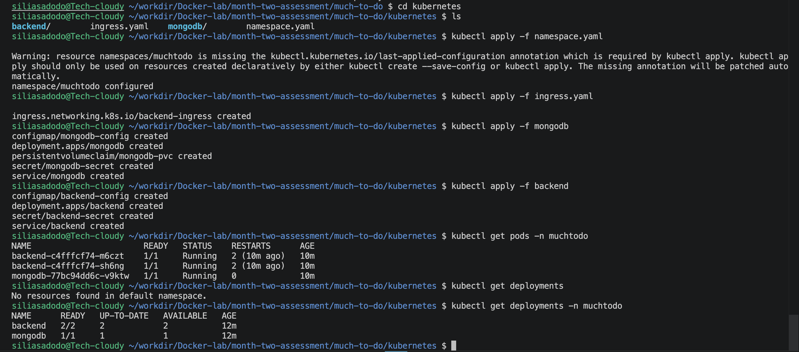

---

## 🔹 6. Application Accessible via Kubernetes

The application was successfully exposed using a **NodePort Service** and optionally via **Ingress**.

**Evidence:**

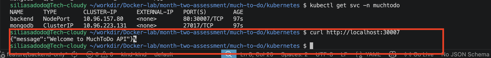
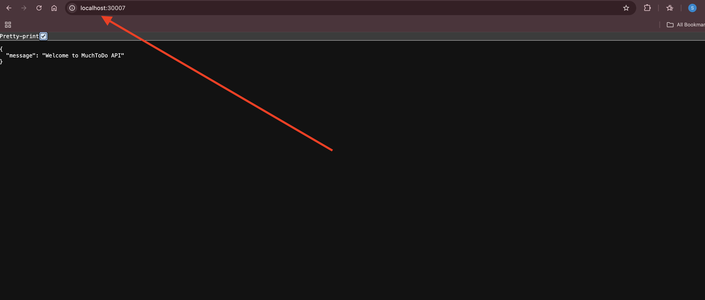

---

## 🔹 7. Kubectl Commands Verification

Kubectl commands were used to verify cluster resources including pods, services, and ingress.

**Evidence:**

### Pods

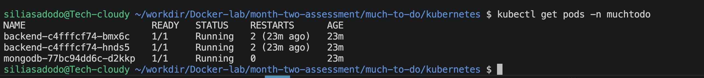

### Services

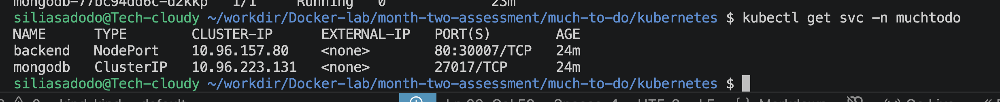

### Ingress

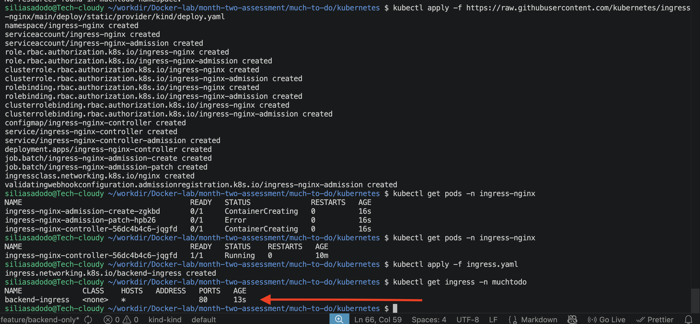

---

## ✅ Summary

* Docker image successfully built
* Docker Compose setup verified
* Application accessible in containerized environment
* Kubernetes cluster created using kind
* Deployments and services running successfully
* Application exposed via NodePort/Ingress
* Cluster resources verified using kubectl

---